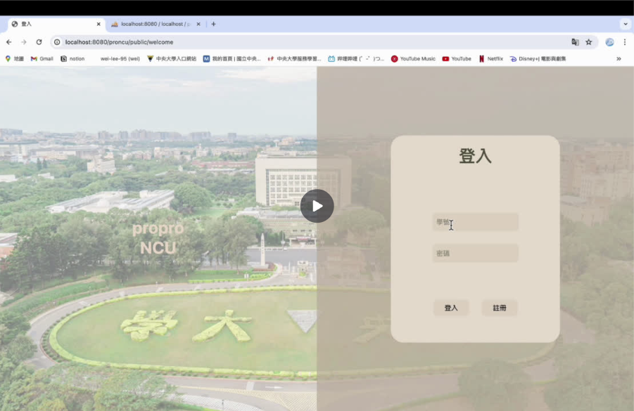

# 學生入口網站系統

這是一個用 Laravel 開發的校園資訊統整網站。
本 repo 是由原本的團隊課程專案整理而成的作品集版本，只展示我負責的後端、資料庫設計與 API 端點。

## Demo 影片

點擊下方圖片觀看系統操作 Demo。

## 專案範圍

此版本中僅保留系統所需後端應用程式碼，並把後端相關內容整理得更清楚。

我的主要負責項目：

- 使用 Laravel 開發後端路由與 Controller
- 設計 users、courses、events 等資料表結構
- 實作以 Session 為基礎的註冊、登入與登出流程
- 建立課程儀表板與課表資料 API
- 建立行事曆事件的查詢、新增與刪除 API
- 透過 JSON 回應與 Blade 路由完成前後端串接

## 特色功能

- 學生註冊與登入
- 使用者名稱與貼圖頭像設定
- 課程搜尋與課程儲存
- 依分類呈現課程儀表板
- 查詢指定學期課表資料
- 行事曆事件管理
- 首頁小工具串接課程與行事曆資料

## 技術使用

- PHP
- Laravel
- MySQL

## 後端重點

### 身分驗證流程

登入與註冊流程由 `WelcomeController` 處理。

- `POST /welcome/register` 建立學生帳號，並初始化 Session 資料。
- `POST /welcome/login` 驗證學號與密碼，成功後把使用者資料存入 Session。
- `GET /logout` 清除 Session，並導回登入頁。

### 課程管理

課程相關功能由 `CourseController` 處理。

- 每筆課程都會透過 `user_sid` 綁定到對應學生。
- 儀表板與課表端點會回傳 JSON，供前端畫面渲染。
- 使用者可以修改課程分類，也可以刪除已儲存課程。

### 行事曆管理

行事曆相關功能由 `CalendarController` 處理。

- 每筆事件都會依照目前登入學生的 Session 資料篩選。
- 系統支援查詢所有事件、查詢當日事件、新增事件與刪除事件。

## 文件

- [API 文件](api-docs/endpoints.md)
- [資料庫設計說明](database-docs/schema.md)
